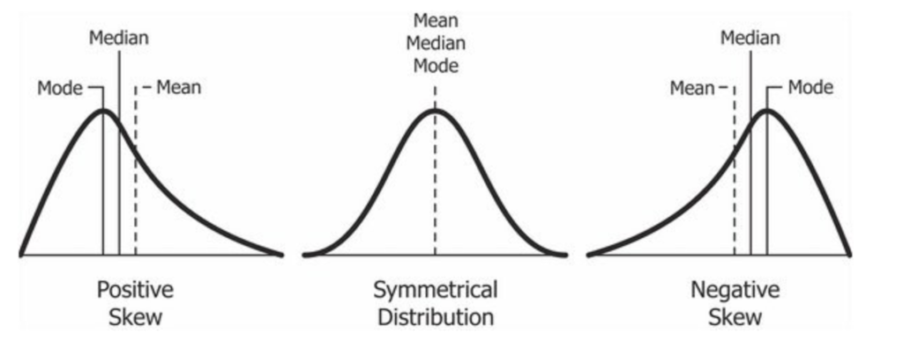
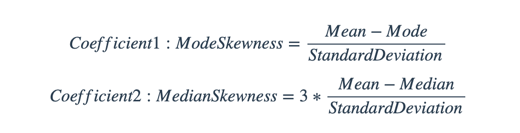

## SUMMARY STATISTICS


One popular method to detect an uneven distribution in the dataset is to compare the average, mode and median values - this statistical property is known as a skew in the distribution.


### Exercises

---

> 1. What is the **average**, **median** and **mode** values of _blood glucose_ values to 2 decimal places?
```postgresql
SELECT
    ROUND(AVG(measure_value), 2) AS average,
    ROUND(PERCENTILE_CONT(0.5) WITHIN GROUP ( ORDER BY measure_value )::NUMERIC, 2) AS median,
    ROUND(MODE() WITHIN GROUP ( ORDER BY measure_value ), 2) AS mode
FROM
    health.user_logs
WHERE
    measure = 'blood_glucose';
```
---
> 2. What is the most frequently occurring `measure_value` value for all blood glucose measurements?
```postgresql
SELECT
    measure_value,
    COUNT(*) AS freqency
FROM
    health.user_logs
WHERE
    measure = 'blood_glucose'
GROUP BY
    measure_value
ORDER BY
    freqency DESC
LIMIT 5;
```
---
> 3. Calculate the 2 Pearson Coefficient of Skewness for blood glucose measures given the following formulas: 
>
>
```postgresql
WITH basic_statistics AS (
    SELECT
        AVG(measure_value) AS mean,
        PERCENTILE_CONT(0.5) WITHIN GROUP ( ORDER BY measure_value ) AS median,
        MODE() WITHIN GROUP ( ORDER BY measure_value ) AS mode,
        STDDEV(measure_value) as stddev
    FROM
        health.user_logs
    WHERE
        measure = 'blood_glucose'
)
SELECT
    ( mean - mode ) / stddev as mode_skewness,
    3 * ( mean - median ) / stddev as median_skewness
FROM
    basic_statistics;
```